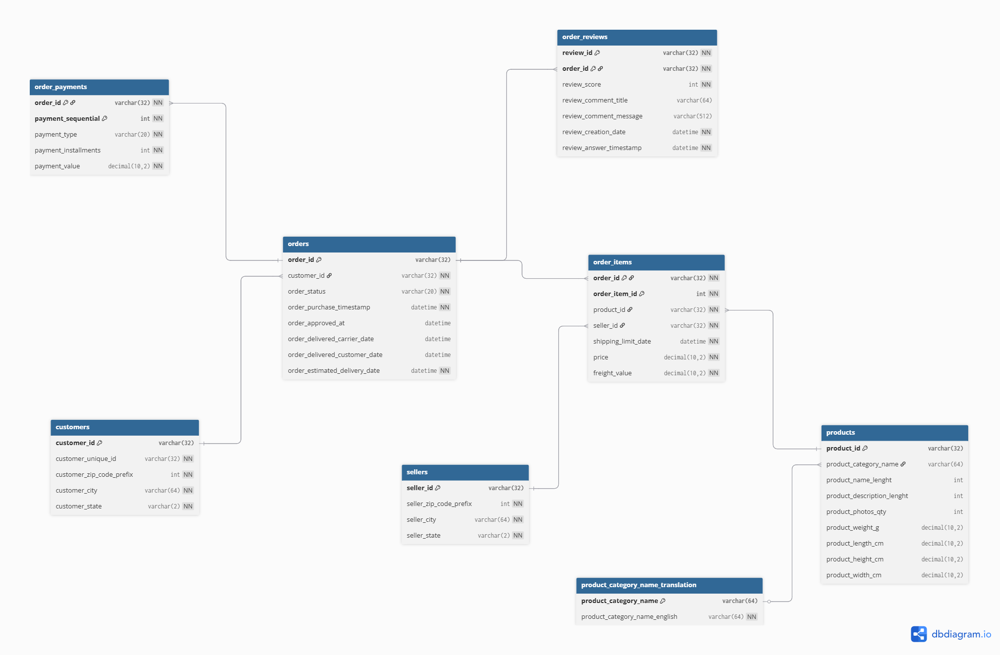
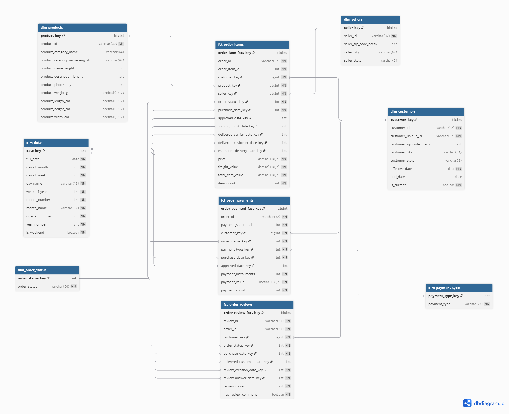

@ -1,270 +1,15 @@
# 🚀 Ecommerce Data Pipeline
Welcome to your new dbt project!

## 1. Introduction
### Using the starter project

This project focuses on the **design and modelling phase of an end-to-end data engineering pipeline** using an ecommerce OLTP dataset.
Try running the following commands:
- dbt run
- dbt test

The goal is to transform raw transactional data into a **scalable analytical data warehouse** by:

- Understanding the source OLTP system  
- Designing a **dimensional model (star schema)**  
- Defining a **data pipeline architecture**  
- Selecting an appropriate **modern data stack**

This project demonstrates strong fundamentals in:

- Data modelling (OLTP → OLAP transformation)
- Star schema design
- Fact and dimension identification
- Slowly Changing Dimension (SCD Type 2)
- Data engineering architecture design

---

## 2. Source Data (OLTP System)

The dataset consists of 8 relational tables representing an ecommerce transactional system:

- customers  
- orders  
- order_items  
- order_payments  
- order_reviews  
- products  
- sellers  
- product_category_translation  

### 🔗 Source ERD

### Key Characteristics

- Highly normalised structure (OLTP)
- Designed for transactional operations
- Complex one-to-many relationships:
  - 1 customer → many orders  
  - 1 order → many items  
  - 1 order → many payments  
- Not optimised for analytics due to:
  - heavy joins
  - duplication risks
  - limited aggregation performance

---

## 3. Architecture Design

The pipeline is designed following a **modern data engineering architecture**:
CSV → Data Lake (S3 - Bronze) → Spark → Data Lake (Silver) → Data Warehouse (Redshift) → dbt → BI Layer

### 🔗 Architecture Diagram

---

### Design Principles

- **Separation of concerns** (ingestion, transformation, modelling)
- **ELT approach** (raw → warehouse → dbt)
- **Scalability** using cloud-native components
- **Reproducibility** via orchestration (Airflow planned)

---

### Planned Pipeline Flow

1. Raw CSV ingestion into **S3 (Bronze layer)**
2. Light transformation using Spark → **S3 Silver layer**
3. Load into **Redshift staging tables**
4. Transform into a dimensional model using **dbt**
5. Serve analytics via **Power BI**

---

## 4. Data Modelling Approach

### 4.1 Modelling Strategy

The modelling process followed industry best practices:

1. Analyse source OLTP schema  
2. Identify business processes  
3. Define fact table grain  
4. Separate facts and dimensions  
5. Design star schema  
6. Introduce SCD Type 2 where required  

---

### 4.2 Business Processes Identified

- Sales (order items)
- Payments
- Customer reviews
- Order lifecycle tracking

---

### 4.3 Grain Definition

| Table | Grain |
|------|------|
| fct_order_items | 1 row per product in an order |
| fct_order_payments | 1 row per payment transaction |
| fct_order_reviews | 1 row per review |

---

## 5. Final Data Model (Star Schema)

### 🔗 Star Schema Diagram

---

### Fact Tables

#### `fct_order_items` (Primary Fact)
- Core sales dataset
- Grain: 1 row per order item
- Measures:
  - price  
  - freight_value  
  - total_item_value  

---

#### `fct_order_payments`
- Captures payment behaviour
- Handles multiple payments per order
- Prevents duplication of revenue metrics

---

#### `fct_order_reviews`
- Stores customer feedback
- Enables satisfaction and delivery analysis

---

### Dimension Tables

#### `dim_customers` (SCD Type 2)

Tracks historical changes in customer attributes.

- Surrogate key: `customer_key`
- Business key: `customer_id`
- Attributes: city, state, zip
- SCD fields:
  - `effective_date`
  - `end_date`
  - `is_current`

---

#### Other Dimensions

- `dim_products`  
- `dim_sellers`  
- `dim_date`  
- `dim_order_status`  
- `dim_payment_type`  

---

## 6. SCD Type 2 Design

SCD Type 2 is implemented on the customer dimension to preserve historical changes.

### Why SCD2?

- Customer location can change over time  
- Business analysis requires historical accuracy  

### Conceptual Approach

- Detect changes in tracked attributes (city/state)
- Expire previous records (`end_date`)
- Insert new version (`is_current = true`)

---

## 7. Key Modelling Decisions

### 1. Separate Fact Tables

Orders have:
- multiple items  
- multiple payments  

→ Combining them would cause **data duplication**

✅ Solution:
- Separate `fct_order_items` and `fct_order_payments`

---

### 2. Surrogate Keys

All dimensions use surrogate keys to:

- enable SCD Type 2  
- improve join performance  
- decouple from source system  

---

### 3. Denormalization Strategy

We intentionally transformed:

**Normalized OLTP → Denormalized Star Schema**

| OLTP Issue | Warehouse Solution |
|-----------|------------------|
| Many joins | Flattened fact tables |
| Duplication risk | Separate facts |
| Poor query performance | Star schema |
| No history tracking | SCD Type 2 |

---

## 8. Tech Stack (Planned)

| Tool | Role |
|-----|------|
| Airflow | Orchestration (DAG + notifications) |
| Amazon S3 | Data lake (Bronze/Silver layers) |
| Apache Spark | Data processing & loading |
| Amazon Redshift | Data warehouse |
| dbt | Data modeling & SCD Type 2 |
| Power BI | Business intelligence |

---

## 9. Business Use Cases (Planned)

The designed model supports:

- Revenue analysis by product/category  
- Customer segmentation  
- Seller performance tracking  
- Payment behaviour analysis  
- Delivery vs customer satisfaction analysis  

---